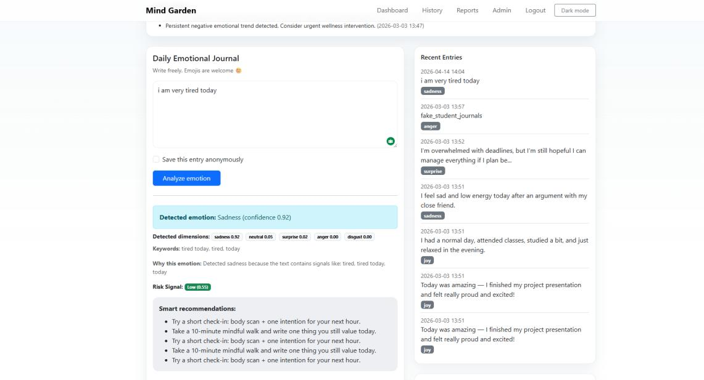
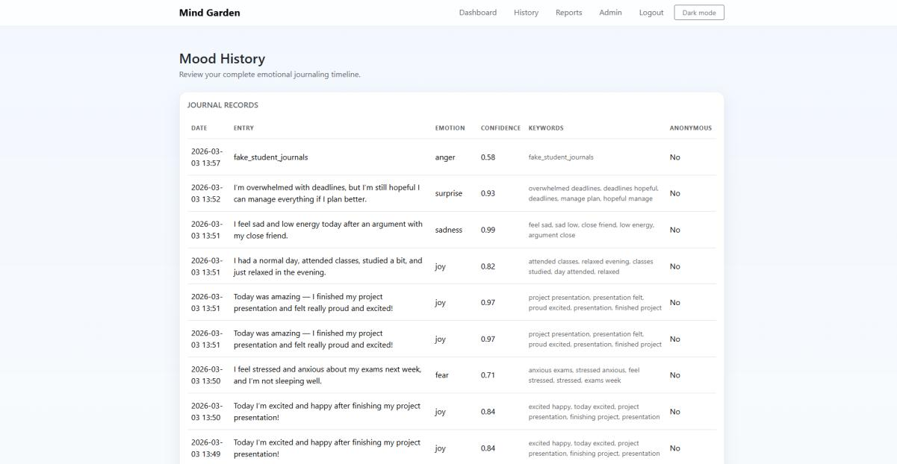
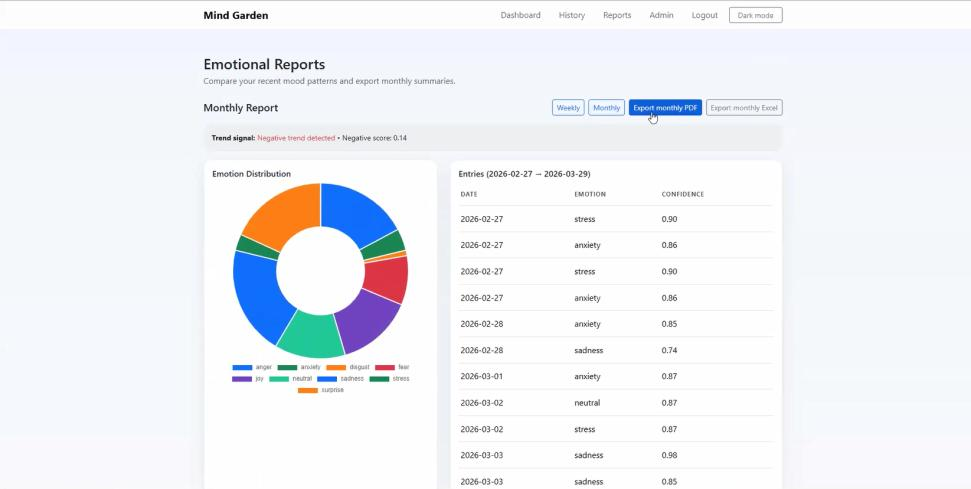
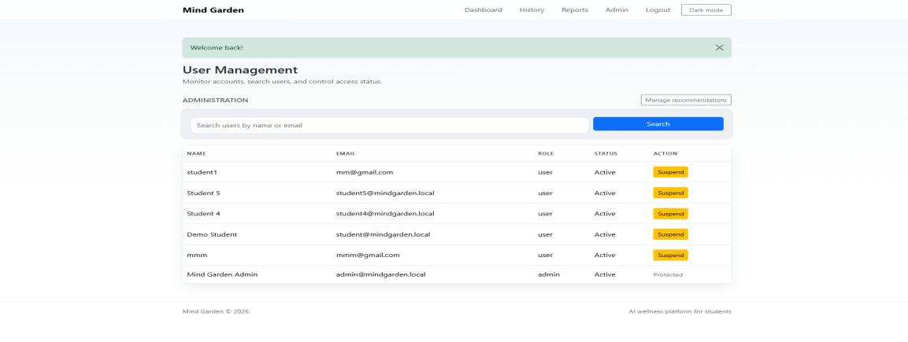

# Mind Garden

## AI-Powered Student Wellness Journal



Mind Garden is a full-stack graduation project that helps university students record journal entries, identify emotional patterns using Natural Language Processing, receive personalized wellness recommendations, and review weekly or monthly trends.

> Mind Garden is an educational wellness-support project. It is not a diagnostic tool and does not replace qualified professional support.

## Project Details

- **Type:** Graduation Project
- **Course:** CYB 419
- **Year:** 2026
- **Role:** Team Leader
- **Portfolio Owner:** Lamya Faisal Alahmari

## Key Features

- Secure registration, login, and session management
- Daily text and emoji journaling
- NLP-based emotion classification and confidence scoring
- Personalized recommendations based on detected emotion
- Mood history and trend analysis
- Weekly and monthly interactive charts
- PDF report export
- Administrator dashboard for users and recommendation rules
- REST-style API endpoints
- Light and dark interface modes

## Technology Stack

- **Backend:** Python, Flask, Flask-Login, Flask-SQLAlchemy
- **Database:** SQLite
- **AI and NLP:** Hugging Face Transformers, Sentence Transformers, KeyBERT
- **Frontend:** HTML, CSS, JavaScript, Bootstrap, Chart.js
- **Reporting:** ReportLab
- **Security:** bcrypt password hashing and environment-based configuration

## Architecture

The application follows Flask's application-factory and Blueprint patterns. Authentication, user features, administration, and API routes are separated into modules. Service modules handle emotion analysis, recommendations, trends, profiles, and alerts.

## Local Setup

```bash
python -m venv .venv
```

Activate the virtual environment, then install dependencies:

```bash
pip install -r requirements.txt
```

Create a local `.env` file using `.env.example`, then run:

```bash
python run.py
```

Open `http://127.0.0.1:5000`.

The first AI-model download may take additional time. If a model cannot load, the application uses its fallback classifier.

## Optional Demo Data

Demo accounts are disabled by default. To create local demo data, set `SEED_DEMO_DATA=1` and provide the four demo account variables shown in `.env.example`. Never commit real passwords or a populated database.

## API Endpoints

- `GET /api/v1/health`
- `POST /api/v1/posts`
- `GET /api/v1/history`
- `GET /api/v1/reports?period=weekly|monthly`

## Leadership Contribution

As Team Leader, Lamya Faisal Alahmari coordinated the graduation-project team, organized tasks and progress follow-up, supported system integration and testing, and helped guide the application, documentation, and presentation to completion.

## Documentation

- [Final report](docs/final-report.pdf)
- [Project plan](docs/project-plan.pdf)

Public portfolio documents omit student identification numbers and other team members' personal details.

## Interface Preview

### Mood History



### Weekly and Monthly Reports



### Administrator Dashboard



## Privacy and Security

- No populated database is included in this repository.
- No journal datasets or user records are included.
- Secrets and demo passwords are configured through environment variables.
- Generated files, local databases, model caches, and Python cache files are excluded.

## Future Improvements

- Production database and cloud deployment
- Expanded multilingual support
- Stronger model evaluation across diverse student language patterns
- Automated testing and continuous integration
- Enhanced accessibility and privacy controls
